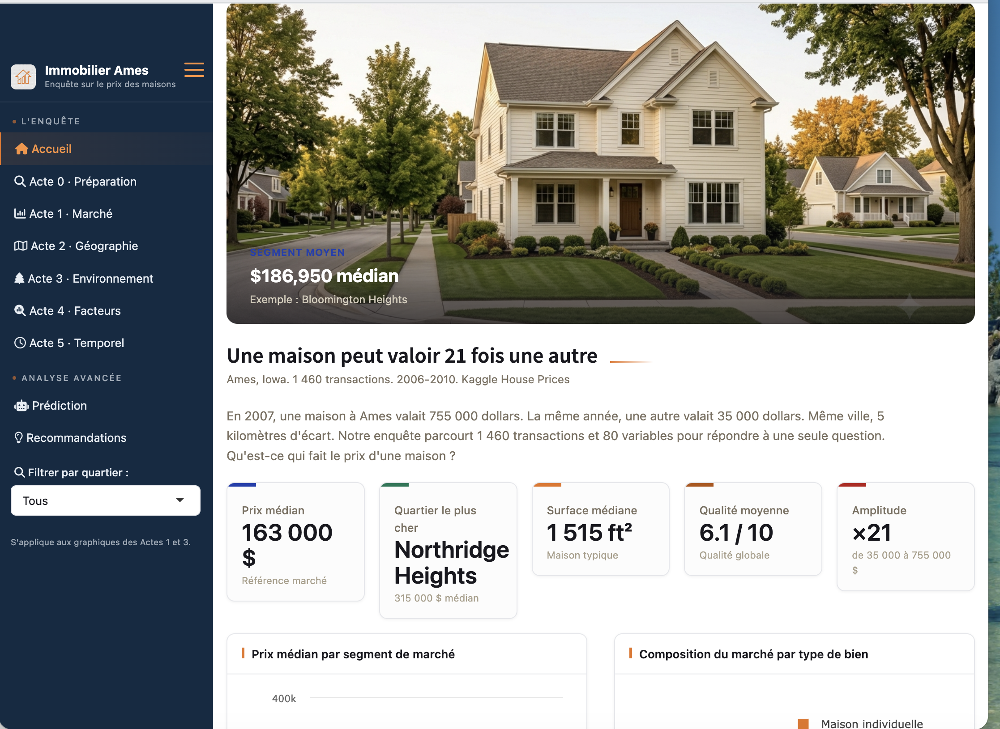
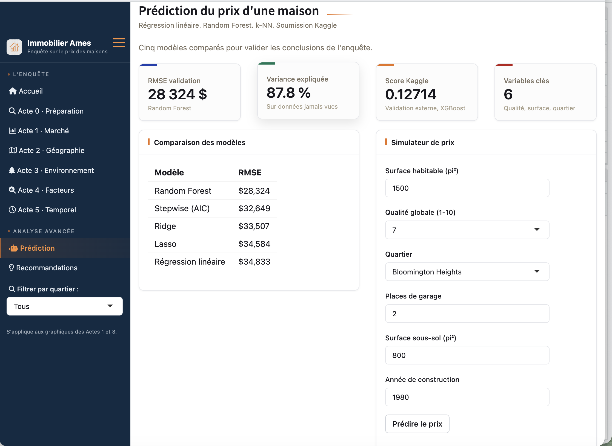

# L'application interactive : du récit au produit

L'enquête n'est pas restituée dans un document figé mais dans une application
web interactive, développée avec Shiny et déployée publiquement à l'adresse
suivante : **https://cam-s.shinyapps.io/ames-immobilier**

## Architecture de l'application

L'application est organisée en neuf pages accessibles depuis un menu latéral,
qui reprennent exactement la structure de l'enquête : une page d'accueil
(indicateurs de référence et parcours guidé), l'Acte 0 (méthodologie et
données nettoyées, téléchargeables depuis l'application), les cinq actes de
l'analyse, une page Prédiction et une page Recommandations. À l'intérieur de
chaque acte, les visualisations sont regroupées en sous-onglets par question
posée — ainsi la navigation elle-même raconte l'enquête.

```{r fig_dashboard_accueil, out.width="95%"}

```

*Figure — Page d'accueil de l'application : les cinq indicateurs de
référence, le carrousel des segments de marché et l'ouverture narrative
de l'enquête.*

Trois mécanismes distinguent cette application d'un document statique :

- **Un filtre global par quartier**, dans le menu latéral, recalcule en direct
  les graphiques des Actes 1 et 3 : chaque graphique est branché sur une
  expression réactive qui filtre les données à la demande, permettant de
  rejouer l'analyse sur un seul quartier.
- **Un comparateur de quartiers** (Acte 2) superpose les profils de deux
  quartiers au choix sur cinq dimensions — prix, surface, qualité, garage,
  récence — et génère automatiquement une lecture textuelle de la comparaison.
- **Un simulateur de prix** (page Prédiction) interroge en direct le modèle
  Random Forest de la section 5 : l'utilisateur décrit un bien en six
  caractéristiques et obtient instantanément une estimation, accompagnée des
  cinq biens réels les plus comparables du dataset (module k-NN).

```{r fig_dashboard_simulateur, out.width="95%"}

```

*Figure — Page Prédiction : comparaison des cinq modèles et simulateur de
prix connecté au Random Forest pré-entraîné.*

## Un produit de data science, pas seulement un rapport

Deux choix d'ingénierie méritent mention. D'abord, le modèle Random Forest
n'est pas ré-entraîné à chaque visite : il est entraîné une fois, sérialisé,
puis chargé au démarrage de l'application — le cycle de vie standard d'un
modèle en production. Ensuite, le déploiement sur shinyapps.io rend
l'application consultable par quiconque dispose du lien, sans installation
de R : l'analyse devient un produit accessible, pas un fichier à exécuter.

Ces capacités — filtres réactifs, simulation en direct, déploiement public —
sont précisément ce qui a motivé l'évolution de flexdashboard vers Shiny
présentée en section 1.4 : un document HTML statique ne peut ni recalculer
un graphique, ni interroger un modèle.
```